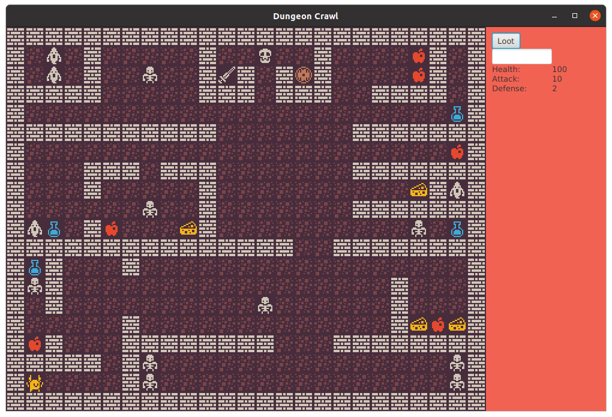

# Dungeon Crawler

This is a teamwork project created during the OOP with Java module of codecool. In this project our goal was to create a roguelike dungeon crawler game based on an already project existing structure with the help of JavaFX and the goal of practicing OOP.

## About the game

The player starts in the bottom left corner of the map with a yellow creature. You can navigate around the map with WASD. There are monsters and items around the map, to interact with these you need to step on their tile. You can pick up items by standing on their tile and clicking the loot button in the side menu. By pressing 'I' you can look at your inventory.

## How to run

 The project is using JavaFX, use the `javafx` maven plugin to build and run the program. Navigate to the project directory in the terminal and use the following commands:  
Build: `mvn javafx:compile`
  Run: `mvn javafx:run`

